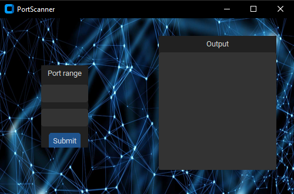

# 
This is a simple port scanner that coded with python and a few libraries. The libraries are customtkinter, socket, 
time and threading

# 🗃️ File Structure
    * 'scanner.py' : main file
    * 'FrameLeft.py' :  saves and scans the ports
    * 'FrameRight.py' : shows the output of scanning

# 🛠️ Compile and Run
* download or clone the repo
```sh
git clone https://github.com/furkansarsilmaz/PortScan

cd PortScan
```

* execute the code
```sh
python scanner.py
```
# 📹 Showcase


# 📜 Notes
This project only tested on Windows. It's open source project and you can develop and share if you wish.